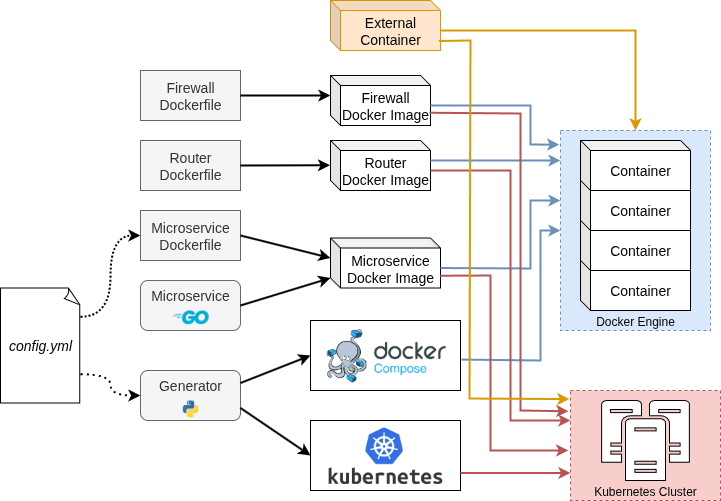

# MicroServices Topology Generator (MSTG)

This tool automates the generation of containerized microservices topologies.

From a single user-provided configuration `yaml` file, it generates the configuration files for [Docker Compose](https://docs.docker.com/compose/) or [Kubernetes](https://kubernetes.io/).

The following entities can be added in the topologies:
- Microservices, which are all instances of the same generic program, will sequentially send requests to the services they are connected to before responding to their own requests;
- External Docker images. Thus, you can reuse your existing containers;
- Routers, firewalls, and switches to simulate a real network environment.

See [generator/README.md](./generator/README.md) for details on the generator of configuration files.

## Architecture of MSTG



## Usage

### Specify the architecture

When invoking `make` commands, the architecture configuration file can be specified as follows:
```bash
CONFIG=<file> make
```

If no argument is given, `make` will look for a file named `config.yaml`.

A simple configuration file might look as follows:
```yaml
frontend:
  type: service
  port: 80
  endpoints:
    - entrypoint: /
      respsize: 512
      connections:
        - path: db
          url: /
db:
  type: service
  port: 10001
  endpoints:
    - entrypoint: /
      respsize: 128
```

See [configuration.md](./docs/configuration.md) for how to write the architecture file and the [config-examples](./config-examples) directory for examples.

### Build the Docker images

To build the Docker images:
```bash
make images
```

To build the Docker images used with the CLT version:
```bash
make images_clt
```

### Generate for Docker Compose

You can generate the architecture with IPv4 or IPv6 with the following commands:
```bash
make ipv4
make ipv6
```

If you want to enable Jaeger to see the traces, you can use one of the following commands depending on whether you want the topology to use IPv4 or IPv6:
```bash
make ipv4_jaeger
make ipv6_jaeger
```

If you want to generate the architecture with CLT, which always uses IPv6 and Jaeger, you can use the command:
```bash
make clt
```

You can add `_https` at the end of each of the previous command (e.g. `make ipv4_https`) to use HTTPS instead of HTTP.

You can start the architecture with:
```bash
make start
```

You can make requests to the services using the following commands and replacing `<port>` with the port of the service to which you want to send a request:
```bash
curl "http://127.0.0.1:<port>/" # IPv4 + HTTP
curl -6 "http://[::1]:<port>/" # IPV6 + HTTP
curl --insecure "https://127.0.0.1:<port>/" # IPv4 + HTTPS
curl --insecure -6 "https://[::1]:<port>/" # IPv6 + HTTPS
```

Choose the command based on which version of IP and HTTP you chose to generate the architecture.

When using HTTPS, you need to add `--insecure` because the services use a self-signed certificate.

If you decided to enable Jaeger, you can see the traces by opening the URL [http://localhost:16686/](http://localhost:16686/) in your Web browser of choice.

You can stop the architecture with:
```bash
make stop
```

### Generate for Kubernetes

See [K8S.md](./docs/K8S.md) for detailed explanations regarding the deployment to Kubernetes.

## CLT

This tool can be used to demonstrate the capabilities of [Cross-Layer Telemetry](https://github.com/Advanced-Observability/cross-layer-telemetry).

Telemetry data will be generated with [OpenTelemetry](https://opentelemetry.io/) and displayed with [Jaeger](https://www.jaegertracing.io/).
Furthermore, telemetry data related to the routers will be generated with [IOAM](https://datatracker.ietf.org/doc/rfc9197/) and gathered with OpenTelemetry data in Jaeger by using the [IOAM collector for Jaeger](https://github.com/Advanced-Observability/ioam-collector-go-jaeger).

## Requirements

You will need:
- [Docker](https://docs.docker.com/get-docker/) (>= v28.0.0);
- [Docker compose](https://docs.docker.com/compose/) (>= 2.36.0) for local deployment;
- A Kubernetes cluster and the [kubectl](https://kubernetes.io/docs/tasks/tools/#kubectl) tool for multi-host deployment. See [K8S.md](./K8S.md) for more info;
- [Python](https://www.python.org/) >= 3.10. Libraries can be installed with `pip3 install -r generator/requirements.txt`;
- The following command-line tools: `grep`, `tr`, `awk`, and [GNU Make](https://www.gnu.org/software/make/);
- *If* you want to use CLT, you need a [Linux kernel 5.17](https://github.com/torvalds/linux/releases/tag/v5.17), [patched](https://github.com/Advanced-Observability/cross-layer-telemetry) for CLT.
- *If* you want to use switches, you need to use a Linux host with enabled Open vSwitch module.

## Disclaimer

> [!WARNING]
> This tool is intended for testing purposes. One should refrain from using this tool in a production environment.
