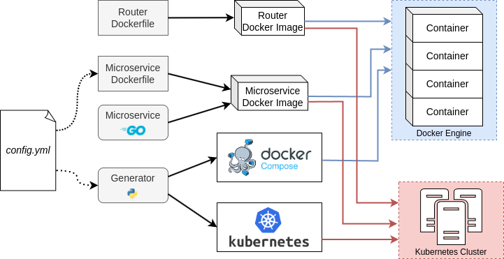

# MicroServices Topology Generator (MSTG)

This tool automates the generation of containerized microservices topologies.

From a single user-provided configuration `yml` file, it generates the intermediary files for [Docker Compose](https://docs.docker.com/compose/) or [Kubernetes](https://kubernetes.io/).

The following entities can be added in the topologies:
- Microservices, which are all instances of the same generic program, will sequentially send requests to the services they are connected to before responding to their own requests;
- External Docker images. Thus, you can reuse your existing containers;
- Routers, firewalls, and switches to simulate a real network environment.

See [generator/README.md](./generator/README.md) for details on the generator of configuration files.

## Architecture of MSTG

## Usage

See [usage.md](./usage.md).

## CLT

This tool can be used to demonstrate the capabilities of [Cross-Layer Telemetry](https://github.com/Advanced-Observability/cross-layer-telemetry).

Telemetry data will be generated with [OpenTelemetry](https://opentelemetry.io/) and displayed with [Jaeger](https://www.jaegertracing.io/).
Furthermore, telemetry data related to the routers will be generated with [IOAM](https://datatracker.ietf.org/doc/rfc9197/) and gathered with OpenTelemetry data in Jaeger by using the [IOAM collector for Jaeger](https://github.com/Advanced-Observability/ioam-collector-go-jaeger).

## Requirements

See [requirements.md](./requirements.md).

## Disclaimer

> [!WARNING]
> This tool is intended for testing purposes. One should refrain from using this tool in a production environment.
