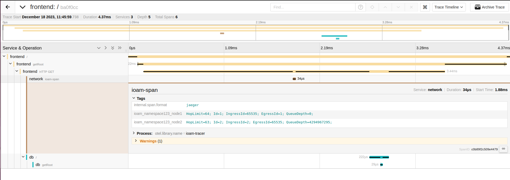
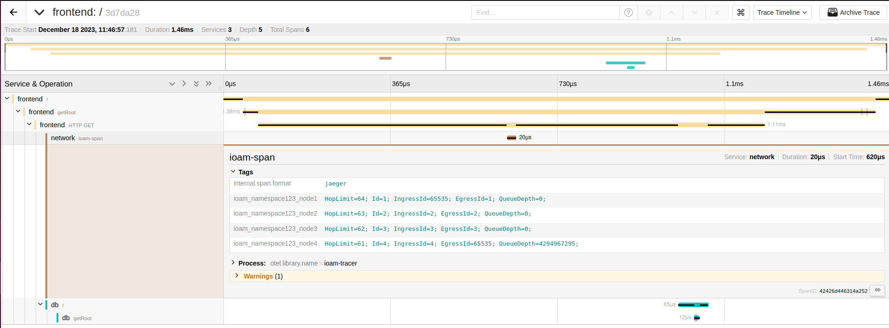
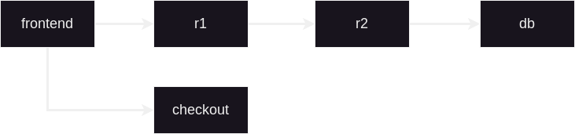
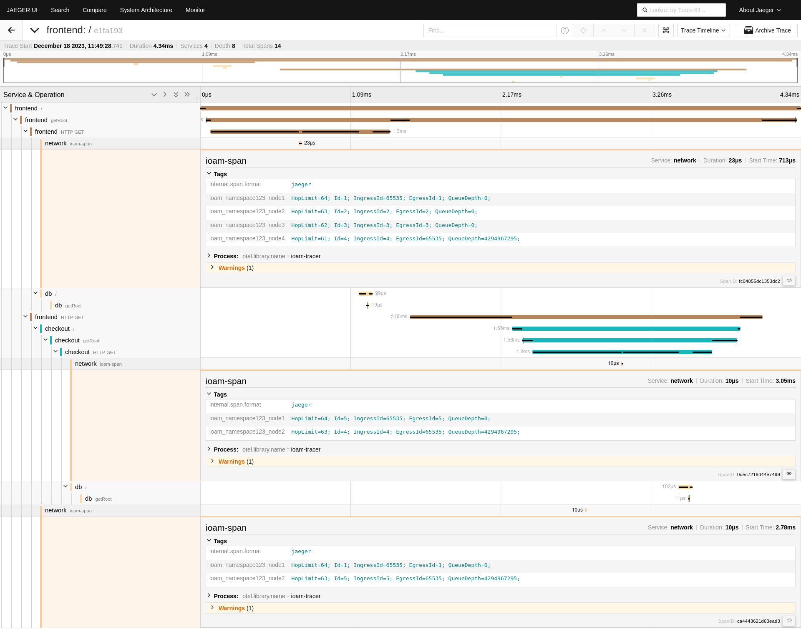

# Examples

This folder contains some examples of configurations for MSTG.

For each example, you can contact the frontend with one of the following commands once the containers are running:
```bash
curl "http://127.0.0.1:80/" # if you generated the architecture with IPv4
curl -6 "http://[::1]:80/" # if you generated the architecture with IPv6
```

After a request has been made, you can see the trace in Jaeger at [http://localhost:16686/](http://localhost:16686/) if Jaeger has been included in the generated architecture.

## Example 1 ([`1_2_entities.yaml`](1_2_entities.yaml))

2 services that are directly connected to each other.




## Example 2 ([`2_1_router_inline.yaml`](2_1_router_inline.yaml))

2 entities that are connected by 1 intermediary router.


## Example 3 ([`3_2_routers_inline.yaml`](3_2_routers_inline.yaml))

2 entities that are connected through 2 routers along the path.




## Example 4 ([`4_service_2_connections.yaml`](4_service_2_connections.yaml))

Same as example 3, but the frontend router contacts an additional service named `checkout`.




## Example 5 ([`5_shared_db.yaml`](5_shared_db.yaml))

Same as example 4, but the service `db` is contacted by both the `frontend` and `checkout` services.




## Example 6 ([`6_modify_traffic.yaml`](./6_modify_traffic.yaml))

Same as example 2 ([2_1_router_inline.yaml](./2_1_router_inline.yaml)) except that some network parameters are fixed on the link connecting the services.

## Example 7 ([7_timers.yaml](./7_timers.yaml))

Same as example 2 ([2_1_router_inline.yaml](./2_1_router_inline.yaml)) except that some timers are configured to modify network parameters (impairments) over a period of time.

## Example 8 ([8_many_endpoints](./8_many_endpoints.yaml))

Same as example 2 ([2_1_router_inline.yaml](./2_1_router_inline.yaml)) except that frontend has 2 endpoints instead of one.

You can query the frontend over IPv4 with:
```bash
curl "http://127.0.0.1:80/" # for the first endpoint
curl "http://127.0.0.1:80/test" # for the second endpoint
```

Or over IPv6 with:
```bash
curl -6 "http://[::1]:80/" # for the first endpoint
curl -6 "http://[::1]:80/test" # for the second endpoint
```

## Example 9 ([9_otel_demo.yaml](./9_otel_demo.yaml))

This example is a copy of the architecture of the [demo of OpenTelemetry](https://opentelemetry.io/docs/demo/architecture/).

## Example 10 ([10_external.yaml](./10_external.yaml))

Same as [2_1_router_inline.yaml](./2_1_router_inline.yaml) using an external image for `frontend`.


## Example 11 ([11_firewall.yaml](./11_firewall.yaml))

2 services with a router and a firewall in between them.


## Example 12 ([12_switch.yaml](./12_switch.yaml))

2 services with a switch in between them.


## Example 13 ([13_switch_vlan.yaml](./13_switch_vlan.yaml))

Same as [12_switch.yaml](./12_switch.yaml) but with VLAN.

## Example 14 ([14_switch_inline.yaml](./14_switch_inline.yaml))

2 switches inline.


## Example 15 ([15_switch_router.yaml](./15_switch_router.yaml))


## Example 16 ([16_switch_router_switch.yaml](./16_switch_router_switch.yaml))


