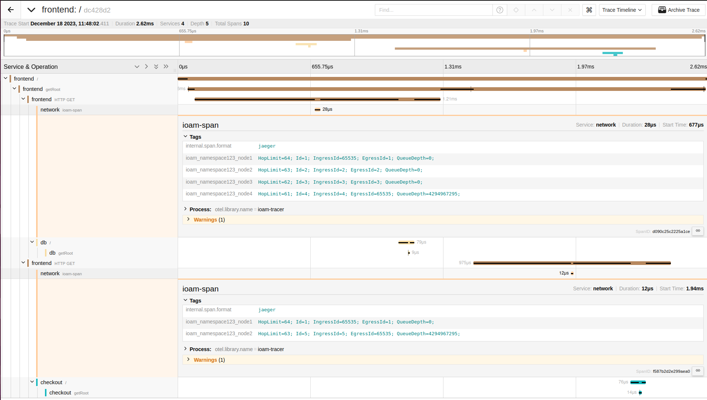

# Examples

This folder contains some examples of configurations for the generator of docker compose files.

For each example, you can contact the frontend with one of the following command once the docker compose is generated and the containers are running on your host.
```bash
curl "http://127.0.0.1:80/" # if you generated the architecture with IPv4
curl -6 "http://[::1]:80/" # if you generated the architecture with IPv6
```

After a request has been made, you can see the trace in Jaeger at [http://localhost:16686/](http://localhost:16686/).

## Example 1 ([`1_2_entities.yml`](1_2_entities.yml))

2 services that are directly connected to each other.


## Example 2 ([`2_1_router_inline.yml`](2_1_router_inline.yml))

2 entities that are connected by 1 intermediary router.


## Example 3 ([`3_2_routers_inline.yml`](3_2_routers_inline.yml))

2 entities that are connected through 2 routers along the path.


## Example 4 ([`4_service_2_connections.yml`](4_service_2_connections.yml))

Same as example 3, but the frontend router contacts an additional service named `checkout`.




## Example 5 ([`5_shared_db.yml`](5_shared_db.yml))

Same as example 4, but the service `db` is contacted by both the `frontend` and `checkout` services.


## Example 6 ([`6_modify_traffic.yml`](./6_modify_traffic.yml))

Same as example 2 ([2_1_router_inline.yml](./2_1_router_inline.yml)) except that some network parameters are fixed on the link connecting the services.

## Example 7 ([7_timers.yml](./7_timers.yml))

Same as example 2 ([2_1_router_inline.yml](./2_1_router_inline.yml)) except that some timers are configured to modify network parameters (impairments) over a period of time.

## Example 8 ([8_many_endpoints](./8_many_endpoints.yml))

Same as example 2 ([2_1_router_inline.yml](./2_1_router_inline.yml)) except that frontend has 2 endpoints instead of one.

You can query the frontend over IPv4 with:
```bash
curl "http://127.0.0.1:80/" # for the first endpoint
curl "http://127.0.0.1:80/test" # for the second endpoint
```

Or over IPv6 with:
```bash
curl -6 "http://[::1]:80/" # for the first endpoint
curl -6 "http://[::1]:80/test" # for the second endpoint
```

## Example 9 ([9_otel_demo.yml](./9_otel_demo.yml))

This example is a copy of the architecture of the [demo of OpenTelemetry](https://opentelemetry.io/docs/demo/architecture/).
